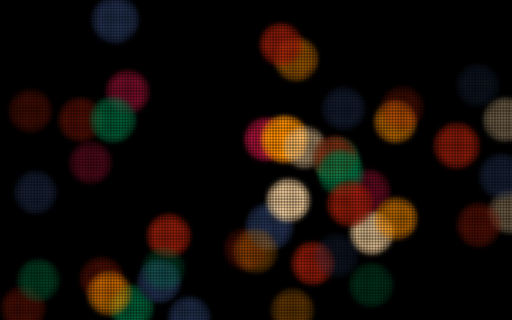

# Christmas Lights

A Christmas-inspired creative coding experiment. [christmas-lights.netlify.com](https://christmas-lights.netlify.com/)

```bash
npm install -g parcel-bundler
npm install
npm start
```

## Then and Now

In 2007, I created an ActionScript 3.0 expirement insipred by the twinkling Christmas lights just outside my window, complete with a screen overlay and Nutcracker ambiance. I decided to revist that experiment using JavaScript as a fun way to see evolution both in the technology and my own approach to creative coding.

| 2007                               | 2018                              |
| :--------------------------------- | :-------------------------------- |
| |  |
